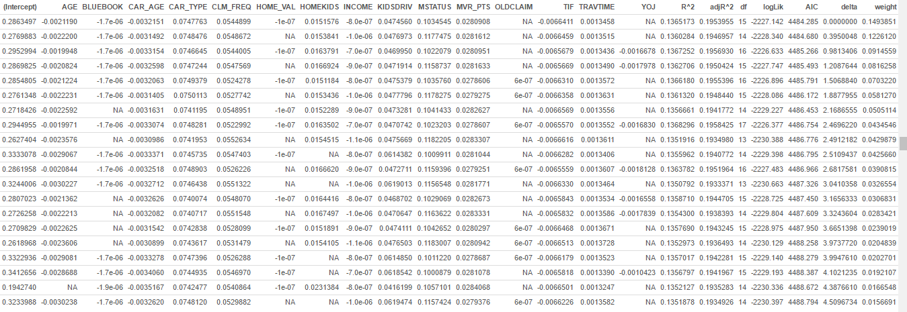
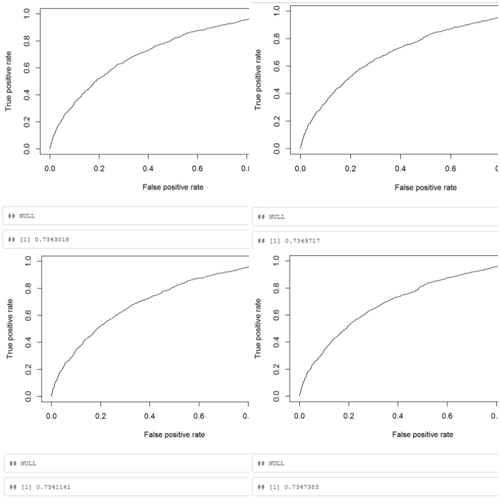

```{r, echo = FALSE, warning = FALSE, message = FALSE}
library(PerformanceAnalytics)
library(ggplot2)
library(gridExtra)
library(knitr)
library(lattice)
library(tidyr)
library(dplyr)
library(pROC)
library(stringr)
library(aod)
library(Rcpp)
library(Amelia)
library(corrplot)
library(gam)
library(pscl)
library(ROCR)
library(gmodels)
library(rpart)
library(Metrics)
```

```{r, echo = FALSE, warning = FALSE, message = FALSE}
data <- read.csv('https://raw.githubusercontent.com/jhamski/DATA621-Homework/master/Homework_4/insurance_training_data.csv?token=AOktEJO3yYvMb6srZdhXqVhhvnIq5mWlks5Xik1uwA%3D%3D', na.string = c("", "NA"), stringsAsFactors = FALSE)
```
#Introduction

  The purpose of this assignment is to build a series two different models. The first model will predict whether a person will get into a car crash and the second model will be used to predict the amount as to which the crash will cost. Both of these models will utilize the customers insurance information to predict the two variables stated above.
  
  Our data consists of 8161 customers with 24 potential predictor variables and 2 target (response) variables. The response variables are:
  
  TARGET_FLAG: This flag will take a value of 0 or 1. One means that the person was in a car crash and 0 means that they were not.
   
  TARGET_AMT: This is the amount associated with the car crash. If the TARGET_FLAG field is 0, then there will be no amount, because the person did not get into a                    crash. If the TARGET_FLAG is a 1, then there will be a value in this field, because there was a crash.

#Data Exploration

  The first thing that has to be taken care of is the missing (NA) values in the data. We can see that in Figure 1.1, there are a few fields that have some missing values. We can see that the fields JOB, CAR_AGE, HOME_VAL, YOJ, AGE and INCOME have missing values. These need to either be removed or imputed to continue on with the analysis.
  
  Figure 1.1
```{r echo = FALSE, warnings = FALSE}  
missmap(data, legend = TRUE, main = "Missing Values vs Observed", col =  c("white", "black"))
```

  We can also see, in the summary statistics (Figure 1.2) some of the data is incorrect. The CAR_AGE filed is showing that the minimum car age is -3. That is not a possible value for that field. That field will have to be looked at more closely to see what other values are invalid. They will have to be re-imputed or removed before the final models are created.
  
  The data also contains 10 categorical variables and 16 numeric variables. The categorical data will need to be converted into a numerical field in order to be plugged into the model and get a value for the two target variables. 
  

Figure 1.2
```{r echo = FALSE}
summary(data)
```

 In Figure 1.3 we take a look at the first target variable (TARGET_FLAG). The summary stats are saying that the mean is less than .5 which means that the data is not evenly disbursed between 0 and 1. The mean would be .5 if that were the case. We can see by the histogram that there are about 3 times as many 0's (no crashes) then there are crashes in this data set. In Figure 1.4, we see that the amount that the customer paid is also around 0. That is agreeing with the high amount of no crashes that we saw in Figure 1.3. This means we can procede with our analysis.
 
Figure 1.3
```{r echo = FALSE}
summary(data$TARGET_FLAG)
hist(data$TARGET_FLAG)
```

Figure 1.3
```{r echo = FALSE}
summary(data$TARGET_AMT)
hist(data$TARGET_AMT)
```


  Finally, we want to look at the variables and see how they correlate with each other. In Figure 1.5 we see a grid that plots each field in the data set against each other. It also shows how strong of a correlation there is between each variable through the correlation value and the amount of starts in each box (correlation significance), 3 stars means that the variables have a very strong correlation and the strength drops as the number of stars drop.
  
  We can see from the grid, that not all of the variables correlate with each other. The variables that appear to not make good predictors would be, MVR_PTS, TRAVTIME, and TIF. These variables have a low correlation signifiance. This means that they may not be good choices to include in our final model for any of the target variables. All of the other variables appear to have a relatively strong correlation between each other and would be good choices for the overall model.
  
Figure 1.5
```{r echo = FALSE, warning = FALSE}
blue_book <- unname(sapply(data$BLUEBOOK, str_replace_all, '[,$]', ''))
blue_book <- as.numeric(blue_book)

income <- unname(sapply(data$INCOME, str_replace_all, '[,$]', ''))
income <- as.numeric(income)

home_val <- unname(sapply(data$HOME_VAL, str_replace_all, '[,$]', ''))
home_val <- as.numeric(home_val)

old_claim <- unname(sapply(data$OLDCLAIM, str_replace_all, '[,$]', ''))
old_claim <- as.numeric(old_claim)

data$BLUEBOOK <- blue_book
data$INCOME <- income
data$HOME_VAL <- home_val
data$OLDCLAIM <- old_claim

data2 <- data[,-c(1,2,3,9,11,12,13,14,16,19,20,23,26)]
chart.Correlation(data2)
```

  Firgue 1.6 is another way to show the correlation between variables, just like in Figure 1.5. This grid has different color/size circles within each variable intersection in the grid. The bigger the circle the better the correlation. We can see that the fields TIF, TRAVTIME, and MVR_PTS are still relatively bad choices for variables, just like in Figure 1.5.
  
Figure 1.6
```{r echo = FALSE}
the_cor <- cor(data[sapply(data, is.numeric)])
#the_cor
corrplot(the_cor, method = "circle")
```

#Data Preparation

##Dealing with NA's and Invalid Values

  The first thing that we want to take care of is the NA's (missing values) in the data. We decided that the best course of action would be to remove any of the records that were not complete. Also, we will remove any of the data that is invalid (like a car age below 0). With the removal of the NA's and the invalid values, the total observations for the data is reduced from 8161 to 6044 total obsverations. That is still plenty of observations to do analysis and modeling on.
  
```{r echo = FALSE}
data <- data[complete.cases(data),]
data <- data[data$CAR_AGE >= 0,]
```

##Categorical Data

  Within our data, there are 10 fields that are categorical. These variables group the data into different sections. The best way to deal with this data is to make dummy variables. Most of the data contains 1 of 2 posibilities (YES/NO etc). This allows me to assign a value of 0 for one possibility and a 1 for another. It changes the factor data into a number so it can be used in the regression analysis. The education and jobs fields were a little different. They have more than 2 possibilities. I grouped the possibilities into logical groups. The eductaion was grouped by level of academic achievement (Masters and above = 1, below is a 0). The education was grouped along the same way, a college education/advanced education was grouped into one (Lwyer, Professional, Manager = 1), everybody else gets a 0. The field of CAR_TYPE is dealt the same way as well. Those who drive a Panel Truck, Pickup or Sports car will be labeled with a 1 and everything else will be labeled with a 0.

```{r echo = FALSE}
data$PARENT1 <- ifelse(data$PARENT1 == "No", 1, 0)
data$SEX <- ifelse(data$SEX == 'M', 0, 1)
data$CAR_USE <- ifelse(data$CAR_USE == 'Commercial', 0, 1)
data$MSTATUS <- ifelse(data$MSTATUS == 'Yes', 0, 1)
data$RED_CAR <- ifelse(data$RED_CAR == "no", 0, 1)
data$EDUCATION <- ifelse(data$EDUCATION %in% c('PhD', "Masters"),0, 1)
data$REVOKED <- ifelse(data$REVOKED == "No", 0, 1)
data$URBANICITY <- ifelse(data$URBANICITY == "Highly Urban/ Urban", 1, 0)
data$JOB <- ifelse(data$JOB %in% c('Professional', 'Manager', 'Student', 'Lawyer'), 1, 0)
data$CAR_TYPE <- ifelse(data$CAR_TYPE %in% c('Panel Truck', "Pickup", "Sports Car"), 1, 0)
```
##Accounting Type Data

  The last thing that needed to be done with the data is to convert the accounting data, into numeric fields. The accounting data (dollar amount data) has dollar signs within the data. That means that the data will be treated as a character set. The dollar sign needs to be removed and the data needs to be changed into a number, so it can be used in the analysis later on.
  
#Build Models
  
##TARGET_FLAG
  This is the target variable that will tell us there was a crash or not for the given customer. If the field takes a value of 0, that means that the customer was not in an accident, or the accident was not their fault. If the field takes a value of 1, that means the customer has been in an accident, or the accident was their fault.
  
  The first thing that we need to do is split the data up into a training set and a test set. We will be taking the data and separating it up so 70% of the data is the training set, and 30% of the data will be the testing set.
  
```{r echo = FALSE}
data <- data[,-1]
data <- data[sample(nrow(data)),]
top <- round(.70 * NROW(data))

train1 <- data[1:top,]
test1 <- data[(top + 1):NROW(data),]
```

###Model 1

  In this model we are doing a type of stepwise function. We are taking the training set and removing some of the variables that we feel are not good predictors. We run the model against the remaining variables and look at the output. Then, we go back through and remove anymore variables that we do not feel are good predictors. That will leave us with a final function that has all the variables that we fell will make the best predicting function. 
  
The output for this function is as follows:
```{r echo = FALSE}
training_2a <- dplyr::select(train1, -c(KIDSDRIV,HOMEKIDS,EDUCATION,JOB,TIF,
                                     CAR_TYPE,OLDCLAIM,CLM_FREQ,MVR_PTS))
M11 <- lm( TARGET_FLAG~ .-TARGET_FLAG, data=training_2a)
#summary(M11)
M12 <- update(M11,.~.-AGE-HOMEKIDS-YOJ-INCOME-SEX-EDUCATION-BLUEBOOK-RED_CAR-OLDCLAIM-CLM_FREQ)
#summary(M12)
TARGET_FLAG_m1 <- M12
summary(TARGET_FLAG_m1)

answer1a <- predict(TARGET_FLAG_m1, type = "response")
answer1a <- ifelse(answer1a <.5, 0, 1)
```

###Model 2

  In this model, we are untilizing a backwards approach into solving for the overall model. The backwards approach to variable selection starts off withh all variables in the model. I then starts to remove fields, until it gets to a point where removing anymore fields will not be beneficial to the model. That is the point when the final model is found.
  
```{r echo = FALSE}
fullmod <- glm(TARGET_FLAG ~ KIDSDRIV + AGE + HOMEKIDS + YOJ + INCOME + PARENT1 + HOME_VAL + MSTATUS + SEX + EDUCATION + JOB + TRAVTIME + CAR_USE + BLUEBOOK + TIF + CAR_TYPE + RED_CAR + OLDCLAIM + CLM_FREQ + REVOKED + MVR_PTS + CAR_AGE + URBANICITY, data = train1, family=binomial(link ='probit'))

backwards <- step(fullmod, trace = 0)
prediction <- round(predict(backwards, type = 'response'), 4)

answer <- ifelse(prediction < .5, 0 ,1)
```

  To solve for the TARGET_FLAG field, I will be using a probit function. This function is very useful when there are only two possible outcomes for the field that you are trying to predict. This model utilizes backwards selection when picking the variables for the model. It starts out all of the variables that are possible. It then starts to remove variables until it reaches the optimal solution for the function. The output from the model is as follows:
  
```{r echo = FALSE}
summary(backwards)
```


###Model 3
  The model is a little interesting in the fact that, the original analysis of the data showed that the fields TIF, TRAVTIME and MVR_PTS were not good predictors. They all had very few starts when being correlated with the other variables. They all showed up in the model. This could be due to the fact that the original analysis was based on a linear comparision. This equation is a log function. That shows that those variables may have a horrible linear relationship with the rest of the variables but a very stong logistic relationship.

```{r echo = FALSE}
nothing <- glm(TARGET_FLAG ~ 1, data = train1, family = binomial(link = 'probit'))
forwards <- step(nothing, scope = list(lower=formula(nothing), upper=formula(fullmod)), direction = "forward", trace = 0)

pred <- round(predict(forwards, type = 'response'), 4)

answer2 <- ifelse(pred < .5, 0 ,1)
```

  To solve for the TARGET_FLAG field, I will be using a probit function, just like during the backwards function. This function goes the opposite way as the backward function. It starts with a plain function and adds variables until it gets to the optimal solution. Once it cannot add variables to make the equation better, it stops and that is the final function. The output for the forward stepping function is as follows:
  
```{r echo = FALSE}
summary(forwards)
```
 
 This functions is very interesting. In the backwards function, stated above (Model 1), the MSTATUS (Marital status) field is positive, but it is negative in the forwards function. The sign switched depending on which way you come at the optimal function. Since the model also contains the field of KIDSDRIV and PARENT1, it is possible that multicolinearity could be playing a factor. It is also very interesting that the TRAVTIME, TIF and MVR_PTS fields are also included in this model just like in the backwards model.
 
###Model 4 (Remove Redundancy, Calculate All Combinations)

Because the data contains such a large number of categorical fields, it is impossible (with our machine power + time constraints) to calculate and test the model for all possible combinations of the categorical's inclusion and/or values.  However, what if some of the fields could ***simply be removed***?  Let's take a look at the ***correlations*** between some of the dependent attributes in our data.


```{r warning=FALSE, echo=FALSE}
cutoff <- nrow(data)*.70
ins.train <- data[1:cutoff,]
ins.test <- data[(cutoff+1):nrow(data),]

calculate_accuracy <- function(frmla){
  fit <- glm(frmla, data=ins.train, family=binomial(link='logit'))
  # http://www.r-bloggers.com/how-to-perform-a-logistic-regression-in-r/
  fitted.results <- predict(fit, newdata=ins.test, type='response', na.action = na.pass)
  fitted.results <- ifelse(fitted.results > 0.5, 1, 0)
  misClasificError <- mean(fitted.results != ins.train$TARGET_FLAG, na.rm=TRUE)
  return (1-misClasificError)  
}

col_names <- c("CAR_TYPE","CAR_USE","EDUCATION","JOB","MSTATUS","PARENT1","RED_CAR","REVOKED","SEX","URBANICITY")

a1 <- calculate_accuracy(TARGET_FLAG ~ CAR_TYPE)
a2 <- calculate_accuracy(TARGET_FLAG ~ CAR_USE)
a3 <- calculate_accuracy(TARGET_FLAG ~ EDUCATION)
a4 <- calculate_accuracy(TARGET_FLAG ~ JOB)
a5 <- calculate_accuracy(TARGET_FLAG ~ MSTATUS)
a6 <- calculate_accuracy(TARGET_FLAG ~ PARENT1)
a7 <- calculate_accuracy(TARGET_FLAG ~ RED_CAR)
a8 <- calculate_accuracy(TARGET_FLAG ~ REVOKED)
a9 <- calculate_accuracy(TARGET_FLAG ~ SEX)
a10 <- calculate_accuracy(TARGET_FLAG ~ URBANICITY)

accuracy <- c(a1,a2,a3,a4,a5,a6,a7,a8,a9,a10)

kable(data.frame(col_names, accuracy))

```

***Those categorical variables have the exact same calculated accuracties.***

Could this be coincidence? Seems those columns could be duplicates, let's run Chi-Square correlation tests to confirm:

```{r warning=FALSE, echo=FALSE}
car_type_to_car_use <- chisq.test(table(ins.train$CAR_TYPE, ins.train$CAR_USE))
car_type_to_education <- chisq.test(table(ins.train$CAR_TYPE, ins.train$EDUCATION))
car_type_to_job <- chisq.test(table(ins.train$CAR_TYPE, ins.train$JOB))
car_type_to_mstatus <- chisq.test(table(ins.train$CAR_TYPE, ins.train$MSTATUS))
car_type_to_parent1 <- chisq.test(table(ins.train$CAR_TYPE, ins.train$PARENT1))
car_type_to_red_car <- chisq.test(table(ins.train$CAR_TYPE, ins.train$RED_CAR))
car_type_to_revoked <- chisq.test(table(ins.train$CAR_TYPE, ins.train$REVOKED))
car_type_to_sex <- chisq.test(table(ins.train$CAR_TYPE, ins.train$SEX))
car_type_to_urbancity <- chisq.test(table(ins.train$CAR_TYPE, ins.train$URBANICITY))

p.car_type_to_car_use <- round(car_type_to_car_use$p.value, digits = 3)
p.car_type_to_education <- round(car_type_to_education$p.value, digits = 3)
p.car_type_to_job <- round(car_type_to_job$p.value, digits = 3)
p.car_type_to_mstatus <- round(car_type_to_mstatus$p.value, digits = 3)
p.car_type_to_parent1 <- round(car_type_to_parent1$p.value, digits = 3)
p.car_type_to_red_car <- round(car_type_to_red_car$p.value, digits = 3)
p.car_type_to_revoked <- round(car_type_to_revoked$p.value, digits = 3)
p.car_type_to_sex <- round(car_type_to_sex$p.value, digits = 3)
p.car_type_to_urbancity <- round(car_type_to_urbancity$p.value, digits = 3)

all_chi_sq_labels <- c("car_type_to_car_use","car_type_to_education","car_type_to_job","car_type_to_mstatus","car_type_to_parent1","car_type_to_red_car","car_type_to_revoked","car_type_to_sex","car_type_to_urbancity")

all_chi_sq_results <- c(p.car_type_to_car_use,p.car_type_to_education,p.car_type_to_job,p.car_type_to_mstatus,p.car_type_to_parent1,p.car_type_to_red_car,p.car_type_to_revoked,p.car_type_to_sex,p.car_type_to_urbancity)

kable(data.frame(all_chi_sq_labels, all_chi_sq_results))
```

***Chi-Squared says some columns are exact duplicates: Remove Them! (We'll keep CARTYPE):***

Why can we simply remove fields?  Imagine there is a categorical called letters with "a","b","c","d" values.  And there is a categorical called numbers with "one","two","three","four".  If for EVERY occurence: 

"a" => "one" 
"b" => "two" 
"c" => "three" 
"d" => "four"

Then would it make sense to calculate a model for all 16 letter-to-number commbinations? Of course not, they are 100% correlated.  We can just keep one of the fields.

```{r warning=FALSE}
drops <- c("CAR_USE","EDUCATION","JOB","PARENT1","RED_CAR","SEX","URBANICITY")
ins.train <- ins.train[ , !(names(ins.train) %in% drops)]
ins.test <- ins.test[ , !(names(ins.test) %in% drops)]
```

Also, ***car_type_to_mstatus*** and ***car_type_to_revoked*** were close, lets compare mstatus to revoked:

```{r warning=FALSE}
mstatus_to_revoked <- chisq.test(table(ins.train$MSTATUS, ins.train$REVOKED))
round(mstatus_to_revoked$p.value, digits = 3)
```

So those are ALSO ***DUPLICATES***, remove REVOKED

```{r warning=FALSE}
drops <- c("REVOKED")
ins.train <- ins.train[ , !(names(ins.train) %in% drops)]
ins.test <- ins.test[ , !(names(ins.test) %in% drops)]
```

So now that we have lowered our number of categorical variables, and thus lowered the total number of possible categorical combinations to calculate, we can use a tool "grind out" every combination and evaluate based on whatever criteria we wish:

***Try out all categorical combinations with a tools, in this case - MuMIn DREDGE***

```{r warning=FALSE, echo=FALSE, eval=FALSE}
do_auc <- function(model, the_data){
  p <- predict(model, newdata=the_data, type="response")
  pr <- prediction(p, the_data$TARGET_FLAG)
  prf <- performance(pr, measure = "tpr", x.measure = "fpr")
  print(plot(prf))
  auc <- performance(pr, measure = "auc")
  auc <- auc@y.values[[1]]
  return (auc)
}

library(MuMIn)
core.glm <- glm(TARGET_FLAG ~  . -TARGET_AMT, data = ins.train)
options(na.action = "na.fail")
dredge.result <- dredge(core.glm, rank="AIC", extra=c("R^2", "adjR^2"))
kable(head(dredge.result, n=4))

dredge.mdl.1 <- get.models(dredge.result, 1)[[1]]
dredge.mdl.2 <- get.models(dredge.result, 2)[[1]]
dredge.mdl.3 <- get.models(dredge.result, 3)[[1]]
dredge.mdl.4 <- get.models(dredge.result, 4)[[1]]

do_auc(dredge.mdl.1, ins.train)
do_auc(dredge.mdl.2, ins.train)
do_auc(dredge.mdl.3, ins.train)
do_auc(dredge.mdl.4, ins.train)
```



***The top 4 Models returned: ***



***All in all, this approach yielded models with AUC's around 0.735, slightly higher than the basic step reduction.***

##TARGET_AMT

  This is the target field that says wether the customer had to pay some amount after an accident. This field will only have a value if the TARGET_FLAG field has a 1. If the TARGET_FLAG field is a 0, then this field will be 0 as well. The first thing that we have to do is re-pick the training set. We do not want to use the exact same training set as before, because it is the same data and we really are not changing anything from the first models. We will be using a 70/30 split just like before.
 
```{r echo = FALSE}
data <- data[data$TARGET_FLAG==1,] # Youqing add
data <- data[sample(nrow(data)),]
top <- round(.70 * NROW(data))

train2 <- data[1:top,]
test2 <- data[(top + 1):NROW(data),]
```

###Model 1

  The first model that will be used is a form of a stepwise function. Bascially, we select a set of fields from the training set and use that as a base model. We take a look at that model and see what fields should be kept and what fields whould be removed. We remove the fields that we feel are not well correlated and get the final model. 
  
  The output for the model is as follows:
```{r echo = FALSE}
training_2a <- dplyr::select(train2, -c(KIDSDRIV,HOMEKIDS,EDUCATION,JOB,TIF,
                                     CAR_TYPE,OLDCLAIM,CLM_FREQ,MVR_PTS))
M11 <- lm(TARGET_AMT~ .-TARGET_FLAG, data=training_2a)
M12 <- update(M11,.~.-HOMEKIDS-YOJ-AGE-REVOKED-INCOME-PARENT1-SEX-EDUCATION-JOB-TRAVTIME-CLM_FREQ-BLUEBOOK-RED_CAR-OLDCLAIM-CLM_FREQ-CAR_AGE) # Youqing - Model changed a little
TARGET_AMT_m1 <- M12

pred5 <- predict(TARGET_AMT_m1)
summary(TARGET_AMT_m1)
```

###Model 2

  The second model that we will be using is a forward selection, like used in the TARGET_FLAG prediction section above. This model takes a "blank" equation and starts to add variables until it finds the optimal solution for the model. It is a very similar process to the first model.
  
  The outout for the model is as follows:
```{r echo = FALSE}
nothing <- lm(TARGET_AMT ~ 1, data = train2)
forwards <- step(nothing, scope = list(lower=formula(nothing), upper=formula(fullmod)), direction = "forward", trace = 0)

pred4 <- predict(forwards)
summary(forwards)
```

  It is very interesting to conpare the two models in this section. We can see by the summary statistics of both models, that Model 1'2 coefficients are are statistically significant (below .05 confidence), while model 1 seems to have a few variables that are not significant at all, but the R squared value for model 1 is lower than the R squared of the second model. It will be interesting to do some further analysis and see which model is actuall better than the other.
  
#Select Models
  Now that all of the models have been created and predicted, it is time to pick and choose which are the best. We will pick the best model for TARGET_FLAG (probit model) and the best model for the TARGET_AMT field (linear regression).
  
##TARGET_FLAG

###F1 Score
```{r echo = FALSE}
t1 <- table(Actual = train1$TARGET_FLAG, Predicted = answer1a)
t1
t2 <- table(Actual = train1$TARGET_FLAG, Predicted = answer)
t2
t3 <- table(Actual = train1$TARGET_FLAG, Predicted = answer2)
t3

fscore <- function(x)
{
  precision <- x[1]/(x[1] + x[4])
  recall <- x[1] / (x[1] + x[3])
  score <- (2*precision*recall)/(precision+recall)
  
  return(c(precision, recall, score))
}

model1 <- fscore(t1)
model2 <- fscore(t2)
model3 <- fscore(t3)
```

  We can take a look at how well the models compare to each other. One way to do that is to look at the F1 score. This score takes the precision and recall of the model and lets us know how the model fairs. The equation for the F1 score is as follows:
  
  \[
    F1 Score = \frac{2*precision*recall}{precision + recall}
  \]
  
  We can see that all of the models have pretty high F1 scores. The best most is model 1 by just a little bit.

\begin{tabular}{ c | c | c | c }
model & precision & recall & F1 Score \\
\hline
model 1 & .8563123 & .9974202 & .9214956 \\
\hline
model 2 & .8722322 & .9316075 & .9009427 \\
\hline
model 3 & .8722322 & .9316075 & .9009427 \\
\end{tabular}

###ROC Curve
  Another way to look at the models is through the ROC curve. The ROC curve comapres the sensitivity of the model with the specificity of the model. It bascially give the performance of the model. With that curve, we can cacluate the AUC (Area Under the Curve). The higher this number is, the better the performance of the model. We can see that model 1 is still the best choice from all three models.
  
```{r echo - FALSE, message=FALSE, warning=FALSE}
train3 <- cbind(train1 , answer1a[1:4231], answer, answer2)

rc1 <- roc(factor(TARGET_FLAG) ~ answer1a[1:4231], data=train3)
rc2 <- roc(factor(TARGET_FLAG) ~ answer, data=train3)
rc3 <- roc(factor(TARGET_FLAG) ~ answer2, data=train3)

plot(rc1,main='Model 1 - ROC Curve')
plot(rc2,main='Model 2 - ROC Curve')
plot(rc3,main='Model 3 - ROC Curve')


model <- c('Model 1', 'Model 2', 'Model 3')
area <- c(auc(train1$TARGET_FLAG, answer1a),auc(train1$TARGET_FLAG, answer),auc(train1$TARGET_FLAG, answer2))
df <- data.frame(Model=model,AUC=area)
df
```

\begin{tabular}{ c | c |}
model & AUC (Area Under Curve)  \\
\hline
model 1 & .7283561 \\
\hline
model 2 & .6572123 \\
\hline
model 3 & .6572123 \\
\end{tabular}

###AIC/BIC/Log-Likelihood

The Akaike information criterion (AIC) is a measure of the relative quality of statistical models for a given set of data. Given a collection of models for the data, AIC estimates the quality of each model, relative to each of the other models. Hence, AIC provides a means for model selection. The lower the AIC the better the model.

Bayesian information criterion (BIC), is a criterion for model selection among a finite set of models. The lower the BIC, the better the model. Ghand and hand with AIC.

We can see that the smallest AIC and BIC is still model number 1. All of the criteria is pointiong towards model number 1. That means that the best model, out of these three would be model number 1 to continue on for the evaluation set.

```{r echo = FALSE}
# Akaike Information Criterion
AIC.1 <- AIC(TARGET_FLAG_m1)
AIC.2 <- AIC(backwards)
AIC.3 <- AIC(forwards)
AIC <- rbind(AIC.1, AIC.2, AIC.3) %>% round(2)

# BIC
BIC.1 <- BIC(TARGET_FLAG_m1)
BIC.2 <- BIC(backwards)
BIC.3 <- BIC(forwards)
BIC <- rbind(BIC.1, BIC.2, BIC.3) %>% round(2)
```

\begin{tabular}{ c | c | c | c }
model & AIC & BIC \\
\hline
model 1 & 3188.62 & 3258.47 \\
\hline
model 2 & 2900.54 & 4021.20 \\
\hline
model 3 & 82733.65 & 82835.25 \\
\end{tabular}

##TARGET_AMT

  We first check the summary stats with the two models. The first this we check is the MSE (Mean Squared Error). This is the mean of the residuals (actual - predicted) squared. It is a good way to see how accurate your model is. A smaller MSE is always good. The next things is the R squared. This is usually called the goodness of fit. The higher the R squared value the better the model is. The last thing is the F-Stat. It is most often used when comparing statistical models that have been fitted to a data set, in order to identify the model that best fits the population from which the data were sampled. 
  
  All three of these parameters are showing that the best model to use would be model 1. It has the lowest MSE, the highest R squared and the highest F-stat (which means a lower alpha value and most statistically relevant). 
  
```{r echo = FALSE}
model1MSE <- Metrics::mse(train2$TARGET_AMT, pred4)
model2MSE <- Metrics::mse(train2$TARGET_AMT, pred5)

col_mse <- c(model1MSE,model2MSE)
col_r_sq <- c(summary(forwards)$r.squared, summary(TARGET_AMT_m1)$r.squared)
col_f_stat <- c(summary(aov(forwards))[[1]]$F[1], summary(aov(TARGET_AMT_m1))[[1]]$F[1])
```

\begin{tabular}{ c | c | c | c }
model & MSE (Mean Squared Error) & R Squared & F-Stat \\
\hline
model 1 & 18051149 & .06530975 & 86.13564 \\
\hline
model 2 & 18329321 & .05090597 & 40.27218 \\
\end{tabular}

  Now we can look at the residuals and see how well they fit to the regression line. In figure 4.1, we look at the first model. Overall, the data does not fit a linear model at all. The histograms of the residual (lower left have corner) are heavily skewed to the right. Almost all of the data is clustered around 0. Next, the normal plot (top left corner) has a pretty obvious bend to it. The line is supposed to be pretty straing. Finally the residual plot (top right corner) show a pretty obvious patter amoungst the points. It is supposed to be random. This is showing that the data is really not lending itself to a linear model. That means that a different model may be a better choice. In figure 4.2, we see the exact same patterns as in Figure 4.1. This data does not lend itself to a linear model.
  
Figure 4.1
```{r echo = FALSE}
par(mfrow = c(2,2))
g1<- qqnorm(forwards$residuals)
g2 <- qqline(forwards$residuals)
g3 <-plot(forwards$residuals ~ train2$TARGET_AMT,
     xlab='',
     ylab='Residuals',
     main='Residual Plot of Model 1')
abline(h=0,lty=3)
g4 <- hist(forwards$residuals)
```

Figure 4.2
```{r echo = FALSE}
par(mfrow = c(2,2))
g1<- qqnorm(TARGET_AMT_m1$residuals)
g2 <- qqline(TARGET_AMT_m1$residuals)
g3 <-plot(TARGET_AMT_m1$residuals ~ train2$TARGET_AMT,
     xlab='',
     ylab='Residuals',
     main='Residual Plot of Model 1')
abline(h=0,lty=3)
g4 <- hist(TARGET_AMT_m1$residuals)
```

  Overal, model 1 is the best choice. The data may not lend itself to a linear model, but it is a better choice then Model 2.
  
  That means, to predict the TARGET_FLAG, we will be using model 1 and to predict the TARGET_AMT we will also be using model 1.

#Model Evaluation
```{r echo = FALSE}
dataeval <- read.csv("https://raw.githubusercontent.com/jhamski/DATA621-Homework/master/Homework_4/insurance-evaluation-data.csv?token=AOktECfwjlXz4XNx-_bCpig4ZcrMnV-jks5Xi8DywA%3D%3D", stringsAsFactors = FALSE, header = TRUE, sep = "," )
dataeval <- dataeval[,-c(1)]

blue_book <- unname(sapply(dataeval$BLUEBOOK, str_replace_all, '[,$]', ''))
blue_book <- as.numeric(blue_book)

income <- unname(sapply(dataeval$INCOME, str_replace_all, '[,$]', ''))
income <- as.numeric(income)

home_val <- unname(sapply(dataeval$HOME_VAL, str_replace_all, '[,$]', ''))
home_val <- as.numeric(home_val)

old_claim <- unname(sapply(dataeval$OLDCLAIM, str_replace_all, '[,$]', ''))
old_claim <- as.numeric(old_claim)

dataeval$BLUEBOOK <- blue_book
dataeval$INCOME <- income
dataeval$HOME_VAL <- home_val
dataeval$OLDCLAIM <- old_claim

dataeval$TARGET_FLAG <- rep(0, NROW(dataeval))
dataeval$TARGET_AMT <- rep(0, NROW(dataeval))

dataeval <- dataeval[complete.cases(dataeval),]
dataeval <- dataeval[dataeval$CAR_AGE >= 0,]

dataeval$PARENT1 <- ifelse(dataeval$PARENT1 == "No", 1, 0)
dataeval$SEX <- ifelse(dataeval$SEX == 'M', 0, 1)
dataeval$CAR_USE <- ifelse(dataeval$CAR_USE == 'Commercial', 0, 1)
dataeval$MSTATUS <- ifelse(dataeval$MSTATUS == 'Yes', 0, 1)
dataeval$RED_CAR <- ifelse(dataeval$RED_CAR == "no", 0, 1)
dataeval$EDUCATION <- ifelse(dataeval$EDUCATION %in% c('PhD', "Masters"),0, 1)
dataeval$REVOKED <- ifelse(dataeval$REVOKED == "No", 0, 1)
dataeval$URBANICITY <- ifelse(dataeval$URBANICITY == "Highly Urban/ Urban", 1, 0)
dataeval$JOB <- ifelse(dataeval$JOB %in% c('Professional', 'Manager', 'Student', 'Lawyer'), 1, 0)
dataeval$CAR_TYPE <- ifelse(dataeval$CAR_TYPE %in% c('Panel Truck', "Pickup", "Sports Car"), 1, 0)
```

  The final flag values adn the amounts can be seen in the final_result.csv
  
```{r echo = FALSE}
predict_eval_target_flag <- predict(TARGET_FLAG_m1, newdata = dataeval, type = 'response')
final_answer <- ifelse(predict_eval_target_flag <.5, 0, 1)

predict_eval_taget_amt <- predict(TARGET_AMT_m1, newdata = dataeval)

everything <- data.frame(Flag = final_answer, Amount = predict_eval_taget_amt) # Youqing changed
everything[everything$Flag==0,]$Amount <- 0 # Youqing added

table(final_answer)
write.csv(everything, file = "final_results.csv")
```

#Code Appendix

```{r eval = FALSE}
library(PerformanceAnalytics)
library(ggplot2)
library(gridExtra)
library(knitr)
library(lattice)
library(tidyr)
library(dplyr)
library(pROC)
library(stringr)
library(aod)
library(Rcpp)
library(Amelia)
library(corrplot)
library(gam)
library(pscl)
library(ROCR)
library(gmodels)
library(rpart)
library(Metrics)

data <- read.csv('https://raw.githubusercontent.com/jhamski/DATA621-Homework/master/Homework_4/insurance_training_data.csv?token=AOktEJO3yYvMb6srZdhXqVhhvnIq5mWlks5Xik1uwA%3D%3D', na.string = c("", "NA"), stringsAsFactors = FALSE)
  
missmap(data, legend = TRUE, main = "Missing Values vs Observed", col =  c("white", "black"))

summary(data)

summary(data$TARGET_FLAG)
hist(data$TARGET_FLAG)

summary(data$TARGET_AMT)
hist(data$TARGET_AMT)

blue_book <- unname(sapply(data$BLUEBOOK, str_replace_all, '[,$]', ''))
blue_book <- as.numeric(blue_book)

income <- unname(sapply(data$INCOME, str_replace_all, '[,$]', ''))
income <- as.numeric(income)

home_val <- unname(sapply(data$HOME_VAL, str_replace_all, '[,$]', ''))
home_val <- as.numeric(home_val)

old_claim <- unname(sapply(data$OLDCLAIM, str_replace_all, '[,$]', ''))
old_claim <- as.numeric(old_claim)

data$BLUEBOOK <- blue_book
data$INCOME <- income
data$HOME_VAL <- home_val
data$OLDCLAIM <- old_claim

data2 <- data[,-c(1,2,3,9,11,12,13,14,16,19,20,23,26)]
chart.Correlation(data2)

the_cor <- cor(data[sapply(data, is.numeric)])
#the_cor
corrplot(the_cor, method = "circle")

data <- data[complete.cases(data),]
data <- data[data$CAR_AGE >= 0,]

data$PARENT1 <- ifelse(data$PARENT1 == "No", 1, 0)
data$SEX <- ifelse(data$SEX == 'M', 0, 1)
data$CAR_USE <- ifelse(data$CAR_USE == 'Commercial', 0, 1)
data$MSTATUS <- ifelse(data$MSTATUS == 'Yes', 0, 1)
data$RED_CAR <- ifelse(data$RED_CAR == "no", 0, 1)
data$EDUCATION <- ifelse(data$EDUCATION %in% c('PhD', "Masters"),0, 1)
data$REVOKED <- ifelse(data$REVOKED == "No", 0, 1)
data$URBANICITY <- ifelse(data$URBANICITY == "Highly Urban/ Urban", 1, 0)
data$JOB <- ifelse(data$JOB %in% c('Professional', 'Manager', 'Student', 'Lawyer'), 1, 0)
data$CAR_TYPE <- ifelse(data$CAR_TYPE %in% c('Panel Truck', "Pickup", "Sports Car"), 1, 0)

data <- data[,-1]
data <- data[sample(nrow(data)),]
top <- round(.70 * NROW(data))

train1 <- data[1:top,]
test1 <- data[(top + 1):NROW(data),]

training_2a <- dplyr::select(train1, -c(KIDSDRIV,HOMEKIDS,EDUCATION,JOB,TIF,
                                     CAR_TYPE,OLDCLAIM,CLM_FREQ,MVR_PTS))
M11 <- lm( TARGET_FLAG~ .-TARGET_FLAG, data=training_2a)
#summary(M11)
M12 <- update(M11,.~.-AGE-HOMEKIDS-YOJ-INCOME-SEX-EDUCATION-BLUEBOOK-RED_CAR-OLDCLAIM-CLM_FREQ)
#summary(M12)
TARGET_FLAG_m1 <- M12
summary(TARGET_FLAG_m1)

answer1a <- predict(TARGET_FLAG_m1, type = "response")
answer1a <- ifelse(answer1a <.5, 0, 1)

fullmod <- glm(TARGET_FLAG ~ KIDSDRIV + AGE + HOMEKIDS + YOJ + INCOME + PARENT1 + HOME_VAL + MSTATUS + SEX + EDUCATION + JOB + TRAVTIME + CAR_USE + BLUEBOOK + TIF + CAR_TYPE + RED_CAR + OLDCLAIM + CLM_FREQ + REVOKED + MVR_PTS + CAR_AGE + URBANICITY, data = train1, family=binomial(link ='probit'))

backwards <- step(fullmod, trace = 0)
prediction <- round(predict(backwards, type = 'response'), 4)

answer <- ifelse(prediction < .5, 0 ,1)

summary(backwards)

nothing <- glm(TARGET_FLAG ~ 1, data = train1, family = binomial(link = 'probit'))
forwards <- step(nothing, scope = list(lower=formula(nothing), upper=formula(fullmod)), direction = "forward", trace = 0)

pred <- round(predict(forwards, type = 'response'), 4)

answer2 <- ifelse(pred < .5, 0 ,1)

summary(forwards)

data <- data[sample(nrow(data)),]
top <- round(.70 * NROW(data))

train2 <- data[1:top,]
test2 <- data[(top + 1):NROW(data),]

training_2a <- dplyr::select(train2, -c(KIDSDRIV,HOMEKIDS,EDUCATION,JOB,TIF,
                                     CAR_TYPE,OLDCLAIM,CLM_FREQ,MVR_PTS))
M11 <- lm(TARGET_AMT~ .-TARGET_FLAG, data=training_2a)
M12 <- update(M11,.~.-AGE-HOMEKIDS-YOJ-INCOME-SEX-EDUCATION-BLUEBOOK-RED_CAR-OLDCLAIM-CLM_FREQ)
TARGET_AMT_m1 <- M12

pred5 <- predict(TARGET_AMT_m1)
summary(TARGET_AMT_m1)

nothing <- lm(TARGET_AMT ~ 1, data = train2)
forwards <- step(nothing, scope = list(lower=formula(nothing), upper=formula(fullmod)), direction = "forward", trace = 0)

pred4 <- predict(forwards)
summary(forwards)

t1 <- table(Actual = train1$TARGET_FLAG, Predicted = answer1a)
t1
t2 <- table(Actual = train1$TARGET_FLAG, Predicted = answer)
t2
t3 <- table(Actual = train1$TARGET_FLAG, Predicted = answer2)
t3

fscore <- function(x)
{
  precision <- x[1]/(x[1] + x[4])
  recall <- x[1] / (x[1] + x[3])
  score <- (2*precision*recall)/(precision+recall)
  
  return(c(precision, recall, score))
}

model1 <- fscore(t1)
model2 <- fscore(t2)
model3 <- fscore(t3)

train3 <- cbind(train1 , answer1a[1:4231], answer, answer2)

rc1 <- roc(factor(TARGET_FLAG) ~ answer1a[1:4231], data=train3)
rc2 <- roc(factor(TARGET_FLAG) ~ answer, data=train3)
rc3 <- roc(factor(TARGET_FLAG) ~ answer2, data=train3)

plot(rc1,main='Model 1 - ROC Curve')
plot(rc2,main='Model 2 - ROC Curve')
plot(rc3,main='Model 3 - ROC Curve')


model <- c('Model 1', 'Model 2', 'Model 3')
area <- c(auc(train1$TARGET_FLAG, answer1a),auc(train1$TARGET_FLAG, answer),auc(train1$TARGET_FLAG, answer2))
df <- data.frame(Model=model,AUC=area)
df

# Akaike Information Criterion
AIC.1 <- AIC(TARGET_FLAG_m1)
AIC.2 <- AIC(backwards)
AIC.3 <- AIC(forwards)
AIC <- rbind(AIC.1, AIC.2, AIC.3) %>% round(2)

# BIC
BIC.1 <- BIC(TARGET_FLAG_m1)
BIC.2 <- BIC(backwards)
BIC.3 <- BIC(forwards)
BIC <- rbind(BIC.1, BIC.2, BIC.3) %>% round(2)

model1MSE <- Metrics::mse(train2$TARGET_AMT, pred4)
model2MSE <- Metrics::mse(train2$TARGET_AMT, pred5)

col_mse <- c(model1MSE,model2MSE)
col_r_sq <- c(summary(forwards)$r.squared, summary(TARGET_AMT_m1)$r.squared)
col_f_stat <- c(summary(aov(forwards))[[1]]$F[1], summary(aov(TARGET_AMT_m1))[[1]]$F[1])

par(mfrow = c(2,2))
g1<- qqnorm(forwards$residuals)
g2 <- qqline(forwards$residuals)
g3 <-plot(forwards$residuals ~ train2$TARGET_AMT,
     xlab='',
     ylab='Residuals',
     main='Residual Plot of Model 1')
abline(h=0,lty=3)
g4 <- hist(forwards$residuals)
```
```{r echo = FALSE}
par(mfrow = c(2,2))
g1<- qqnorm(TARGET_AMT_m1$residuals)
g2 <- qqline(TARGET_AMT_m1$residuals)
g3 <-plot(TARGET_AMT_m1$residuals ~ train2$TARGET_AMT,
     xlab='',
     ylab='Residuals',
     main='Residual Plot of Model 1')
abline(h=0,lty=3)
g4 <- hist(TARGET_AMT_m1$residuals)

dataeval <- read.csv("https://raw.githubusercontent.com/jhamski/DATA621-Homework/master/Homework_4/insurance-evaluation-data.csv?token=AOktECfwjlXz4XNx-_bCpig4ZcrMnV-jks5Xi8DywA%3D%3D", stringsAsFactors = FALSE, header = TRUE, sep = "," )
dataeval <- dataeval[,-c(1)]

blue_book <- unname(sapply(dataeval$BLUEBOOK, str_replace_all, '[,$]', ''))
blue_book <- as.numeric(blue_book)

income <- unname(sapply(dataeval$INCOME, str_replace_all, '[,$]', ''))
income <- as.numeric(income)

home_val <- unname(sapply(dataeval$HOME_VAL, str_replace_all, '[,$]', ''))
home_val <- as.numeric(home_val)

old_claim <- unname(sapply(dataeval$OLDCLAIM, str_replace_all, '[,$]', ''))
old_claim <- as.numeric(old_claim)

dataeval$BLUEBOOK <- blue_book
dataeval$INCOME <- income
dataeval$HOME_VAL <- home_val
dataeval$OLDCLAIM <- old_claim

dataeval$TARGET_FLAG <- rep(0, NROW(dataeval))
dataeval$TARGET_AMT <- rep(0, NROW(dataeval))

dataeval <- dataeval[complete.cases(dataeval),]
dataeval <- dataeval[dataeval$CAR_AGE >= 0,]

dataeval$PARENT1 <- ifelse(dataeval$PARENT1 == "No", 1, 0)
dataeval$SEX <- ifelse(dataeval$SEX == 'M', 0, 1)
dataeval$CAR_USE <- ifelse(dataeval$CAR_USE == 'Commercial', 0, 1)
dataeval$MSTATUS <- ifelse(dataeval$MSTATUS == 'Yes', 0, 1)
dataeval$RED_CAR <- ifelse(dataeval$RED_CAR == "no", 0, 1)
dataeval$EDUCATION <- ifelse(dataeval$EDUCATION %in% c('PhD', "Masters"),0, 1)
dataeval$REVOKED <- ifelse(dataeval$REVOKED == "No", 0, 1)
dataeval$URBANICITY <- ifelse(dataeval$URBANICITY == "Highly Urban/ Urban", 1, 0)
dataeval$JOB <- ifelse(dataeval$JOB %in% c('Professional', 'Manager', 'Student', 'Lawyer'), 1, 0)
dataeval$CAR_TYPE <- ifelse(dataeval$CAR_TYPE %in% c('Panel Truck', "Pickup", "Sports Car"), 1, 0)

predict_eval_target_flag <- predict(TARGET_FLAG_m1, newdata = dataeval, type = 'response')
final_answer <- ifelse(predict_eval_target_flag <.5, 0, 1)

predict_eval_taget_amt <- predict(TARGET_AMT_m1, newdata = dataeval)

everything <- cbind(Flag = final_answer, Amount = predict_eval_taget_amt)

table(final_answer)
write.csv(everything, file = "final_results.csv")
```