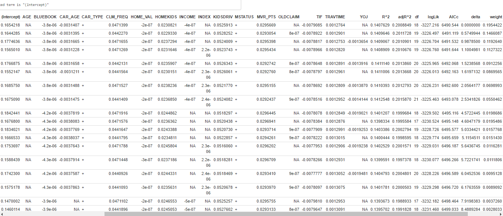

```{r warning=FALSE, echo=FALSE, message=FALSE}
# Libraries/CONSTANTS
library(stringr)
library(aod)
library(ggplot2)
library(Rcpp)
library(knitr)
library(Amelia)
library(MASS)
library(corrplot)
library(gam)
library(pscl)
library(pROC)
library(caret)
library(ROCR)

DO_DEBUG = FALSE
```

# Outline:

* This data set has ***HIGH CORRELATIONS*** between dependent variables.
* Regular "Step" selection does is not having much of an impact (AUC stays the same before and after attribute selection).
* So calculate and rank all combinations of categorical variables by brute force. (after removing repeat highly correlated data)

# Load Data:

Converting the money character fields to numeric.

```{r warning=FALSE, echo=FALSE}
ins <- read.csv('insurance_training_data.csv',na.strings=c("","NA"),stringsAsFactors = FALSE)
if(DO_DEBUG){
  colnames(ins)
}
blue_book <- unname(sapply(ins$BLUEBOOK, str_replace_all, '[,$]', ''))
blue_book <- as.numeric(blue_book)

income <- unname(sapply(ins$INCOME, str_replace_all, '[,$]', ''))
income <- as.numeric(income)

home_val <- unname(sapply(ins$HOME_VAL, str_replace_all, '[,$]', ''))
home_val <- as.numeric(home_val)

old_claim <- unname(sapply(ins$OLDCLAIM, str_replace_all, '[,$]', ''))
old_claim <- as.numeric(old_claim)

ins$BLUEBOOK <- blue_book
ins$INCOME <- income
ins$HOME_VAL <- home_val
ins$OLDCLAIM <- old_claim

#ins$TARGET_FLAG <- factor(ins$TARGET_FLAG)
ins$CAR_TYPE <- factor(ins$CAR_TYPE)
ins$CAR_USE <- factor(ins$CAR_USE)
ins$EDUCATION <- factor(ins$EDUCATION)
ins$JOB <- factor(ins$JOB)
ins$MSTATUS <- factor(ins$MSTATUS)
ins$PARENT1 <- factor(ins$PARENT1)
ins$RED_CAR <- factor(ins$RED_CAR)
ins$REVOKED <- factor(ins$REVOKED)
ins$SEX <- factor(ins$SEX)
ins$URBANICITY <- factor(ins$URBANICITY)

kable(head(ins, n = 5))
```

### Plot and fill in the Nulls.

```{r warning=FALSE, echo=FALSE}
missmap(ins, main = "Missing values BEFORE")

ins$JOB[is.na(ins$JOB)] <- sample(ins$JOB[!is.na(ins$JOB)])
ins$CAR_AGE[is.na(ins$CAR_AGE)] <- sample(ins$CAR_AGE[!is.na(ins$CAR_AGE)])
ins$HOME_VAL[is.na(ins$HOME_VAL)] <- sample(ins$HOME_VAL[!is.na(ins$HOME_VAL)])
ins$YOJ[is.na(ins$YOJ)] <- sample(ins$YOJ[!is.na(ins$YOJ)])
ins$INCOME[is.na(ins$INCOME)] <- sample(ins$INCOME[!is.na(ins$INCOME)])

missmap(ins, main = "Missing values AFTER")

```

# Data Exploration

The cor plot shows ***VERY LITTLE CORRELATION*** between TARGET_FLAG/AMT and other fields (a "Weak" model?):

```{r warning=FALSE, echo=FALSE}
if(DO_DEBUG){
  xtabs(~ TARGET_FLAG + SEX, data = ins)
  xtabs(~ TARGET_FLAG + CAR_TYPE, data = ins)
  xtabs(~ TARGET_FLAG + CAR_USE, data = ins)
  xtabs(~ TARGET_FLAG + EDUCATION, data = ins)
  xtabs(~ TARGET_FLAG + JOB, data = ins)
  xtabs(~ TARGET_FLAG + MSTATUS, data = ins)
  xtabs(~ TARGET_FLAG + PARENT1, data = ins)
  xtabs(~ TARGET_FLAG + RED_CAR, data = ins)
  xtabs(~ TARGET_FLAG + REVOKED, data = ins)
  xtabs(~ TARGET_FLAG + SEX, data = ins)
  xtabs(~ TARGET_FLAG + URBANICITY, data = ins)
}

the_cor <- cor(ins[sapply(ins, is.numeric)])
#the_cor
corrplot(the_cor, method = "circle")

```

# Work:

Build multiple linear regression and binary logistic regression models to: 
* predict the probability that a person will crash their car and also 
* the amount of money it will cost if the person does crash their car

TARGET_FLAG: Was Car in a crash? 1=YES 0=NO

```{r warning=FALSE}
cutoff <- nrow(ins)*.75
ins.train <- ins[1:cutoff,]
ins.test <- ins[(cutoff+1):nrow(ins),]

```

## Calculate the prediction ACCURACY based on JUST the Categorical Variables:

```{r warning=FALSE, echo=FALSE}
calculate_accuracy <- function(frmla){
  fit <- glm(frmla, data=ins.train, family=binomial(link='logit'))
  # http://www.r-bloggers.com/how-to-perform-a-logistic-regression-in-r/
  fitted.results <- predict(fit, newdata=ins.test, type='response', na.action = na.pass)
  fitted.results <- ifelse(fitted.results > 0.5, 1, 0)
  
  head(fitted.results)
  head(ins.train$TARGET_FLAG)
  head(fitted.results != ins.train$TARGET_FLAG)
  
  misClasificError <- mean(fitted.results != ins.train$TARGET_FLAG, na.rm=TRUE)
  return (1-misClasificError)  
  
}

col_names <- c("CAR_TYPE","CAR_USE","EDUCATION","JOB","MSTATUS","PARENT1","RED_CAR","REVOKED","SEX","URBANICITY")

a1 <- calculate_accuracy(TARGET_FLAG ~ CAR_TYPE)
a2 <- calculate_accuracy(TARGET_FLAG ~ CAR_USE)
a3 <- calculate_accuracy(TARGET_FLAG ~ EDUCATION)
a4 <- calculate_accuracy(TARGET_FLAG ~ JOB)
a5 <- calculate_accuracy(TARGET_FLAG ~ MSTATUS)
a6 <- calculate_accuracy(TARGET_FLAG ~ PARENT1)
a7 <- calculate_accuracy(TARGET_FLAG ~ RED_CAR)
a8 <- calculate_accuracy(TARGET_FLAG ~ REVOKED)
a9 <- calculate_accuracy(TARGET_FLAG ~ SEX)
a10 <- calculate_accuracy(TARGET_FLAG ~ URBANICITY)

accuracy <- c(a1,a2,a3,a4,a5,a6,a7,a8,a9,a10)

kable(data.frame(col_names, accuracy))
```

## Those categorical variables have the exact same calculated accuracties.

Could this be coincidence? Seems those columns are duplicates, run Chi-Square correlation tests to confirm:

```{r warning=FALSE, echo=FALSE}
car_type_to_car_use <- chisq.test(table(ins.train$CAR_TYPE, ins.train$CAR_USE))
car_type_to_education <- chisq.test(table(ins.train$CAR_TYPE, ins.train$EDUCATION))
car_type_to_job <- chisq.test(table(ins.train$CAR_TYPE, ins.train$JOB))
car_type_to_mstatus <- chisq.test(table(ins.train$CAR_TYPE, ins.train$MSTATUS))
car_type_to_parent1 <- chisq.test(table(ins.train$CAR_TYPE, ins.train$PARENT1))
car_type_to_red_car <- chisq.test(table(ins.train$CAR_TYPE, ins.train$RED_CAR))
car_type_to_revoked <- chisq.test(table(ins.train$CAR_TYPE, ins.train$REVOKED))
car_type_to_sex <- chisq.test(table(ins.train$CAR_TYPE, ins.train$SEX))
car_type_to_urbancity <- chisq.test(table(ins.train$CAR_TYPE, ins.train$URBANICITY))

if(DO_DEBUG){
  car_type_to_car_use
  car_type_to_education
  car_type_to_job
  car_type_to_mstatus
  car_type_to_parent1
  car_type_to_red_car
  car_type_to_revoked
  car_type_to_sex
  car_type_to_urbancity
}

p.car_type_to_car_use <- round(car_type_to_car_use$p.value, digits = 3)
p.car_type_to_education <- round(car_type_to_education$p.value, digits = 3)
p.car_type_to_job <- round(car_type_to_job$p.value, digits = 3)
p.car_type_to_mstatus <- round(car_type_to_mstatus$p.value, digits = 3)
p.car_type_to_parent1 <- round(car_type_to_parent1$p.value, digits = 3)
p.car_type_to_red_car <- round(car_type_to_red_car$p.value, digits = 3)
p.car_type_to_revoked <- round(car_type_to_revoked$p.value, digits = 3)
p.car_type_to_sex <- round(car_type_to_sex$p.value, digits = 3)
p.car_type_to_urbancity <- round(car_type_to_urbancity$p.value, digits = 3)

all_chi_sq_labels <- c("car_type_to_car_use","car_type_to_education","car_type_to_job","car_type_to_mstatus","car_type_to_parent1","car_type_to_red_car","car_type_to_revoked","car_type_to_sex","car_type_to_urbancity")

all_chi_sq_results <- c(p.car_type_to_car_use,p.car_type_to_education,p.car_type_to_job,p.car_type_to_mstatus,p.car_type_to_parent1,p.car_type_to_red_car,p.car_type_to_revoked,p.car_type_to_sex,p.car_type_to_urbancity)

kable(data.frame(all_chi_sq_labels, all_chi_sq_results))
```

## Chi-Squared says some columns are exact duplicates: Remove Them! (We'll keep CARTYPE):

```{r warning=FALSE}
drops <- c("CAR_USE","EDUCATION","JOB","PARENT1","RED_CAR","SEX","URBANICITY")
ins.train <- ins.train[ , !(names(ins.train) %in% drops)]
ins.test <- ins.test[ , !(names(ins.test) %in% drops)]
```

Also, ***car_type_to_mstatus*** and ***car_type_to_revoked*** were close, lets compare mstatus to revoked:

```{r warning=FALSE}
mstatus_to_revoked <- chisq.test(table(ins.train$MSTATUS, ins.train$REVOKED))
round(mstatus_to_revoked$p.value, digits = 3)
```

So those are ALSO ***DUPLICATES***, remove REVOKED

```{r warning=FALSE}
drops <- c("REVOKED")
ins.train <- ins.train[ , !(names(ins.train) %in% drops)]
ins.test <- ins.test[ , !(names(ins.test) %in% drops)]
```

## Look at the data after those drops:

```{r warning=FALSE}
kable(head(ins.train))
```

## Now, try some basic Step Selection:

```{r warning=FALSE, message=FALSE, echo=FALSE}
get_accuracy <- function(the_model, the_data){
  fitted.results <- predict(the_model, newdata=the_data, type='response')
  magic_number <- 0.5
  #magic_number <- mean(fitted.results)
  fitted.results <- ifelse(fitted.results > magic_number, 1, 0)
  misClasificError <- mean(fitted.results != the_data$TARGET_FLAG)
  return (1-misClasificError)
}

get_anova <- function(the_model){
  return (anova(the_model, test="Chisq"))
}

do_auc <- function(model, the_data){
  p <- predict(model, newdata=the_data, type="response")
  pr <- prediction(p, the_data$TARGET_FLAG)
  prf <- performance(pr, measure = "tpr", x.measure = "fpr")
  print(plot(prf))
  auc <- performance(pr, measure = "auc")
  auc <- auc@y.values[[1]]
  return (auc)
}

# http://data.princeton.edu/R/glms.html
glm.logit.before <- glm(TARGET_FLAG ~ . -TARGET_AMT, data = ins.train, family=binomial(link='logit'))
glm.logit.after <- stepAIC(glm.logit.before, trace = FALSE)

cat('ACCURACY (BEFORE STEPS):')
get_accuracy(glm.logit.before, ins.test)
cat('ACCURACY (AFTER STEPS):')
get_accuracy(glm.logit.after, ins.test)

cat('AUC (BEFORE STEPS):')
do_auc(glm.logit.before, ins.test)
cat('AUC (AFTER STEPS):')
do_auc(glm.logit.after, ins.test)

# Some extra stats, proving the same equality...
if(FALSE){
  get_anova(glm.logit.before)
  get_anova(glm.logit.after)
  
  pR2(glm.logit.before)
  pR2(glm.logit.after)
  
  anova(glm.logit.before, test="Chisq")
  anova(glm.logit.after, test="Chisq")
  ## CIs using profiled log-likelihood
  confint(glm.logit.before)
  confint(glm.logit.after)
  ## CIs using standard errors
  confint.default(glm.logit.before)
  confint.default(glm.logit.after)
}  

```

# The Point: Step Selection (STILL) not giving much of an improvement.

So what can we do when no columns are showing real strength above the others?

# Grind out all combinations with some Tools: MuMIn DREDGE

```{r warning=FALSE, echo=TRUE, eval=FALSE}
library(MuMIn)
core.glm <- glm(TARGET_FLAG ~  . -TARGET_AMT, data = ins.train)
options(na.action = "na.fail")
#dredge.result <- dredge(core.glm, rank="AIC", extra=c("R^2", "adjR^2"))
dredge.result <- dredge(core.glm, extra=c("R^2", "adjR^2"))
kable(head(dredge.result, n=20))
```



# So evaluate the top 3 models in the chart:

```{r warning=FALSE, echo=TRUE}
model_num_1 <- glm(TARGET_FLAG ~ BLUEBOOK + CAR_AGE + CAR_TYPE + CLM_FREQ + HOME_VAL + HOMEKIDS + INCOME + KIDSDRIV + MSTATUS + MVR_PTS + TIF + TRAVTIME + YOJ, data = ins.test)
do_auc(model_num_1, ins.test)

# model 2 is same as 1, only with OLDCLAIM added
model_num_2 <- glm(TARGET_FLAG ~ BLUEBOOK + CAR_AGE + CAR_TYPE + CLM_FREQ + HOME_VAL + HOMEKIDS + INCOME + KIDSDRIV + MSTATUS + MVR_PTS + OLDCLAIM + TIF + TRAVTIME + YOJ, data = ins.test)
do_auc(model_num_2, ins.test)

# model 3 is same as 1, only with YOJ added
model_num_3 <- glm(TARGET_FLAG ~ BLUEBOOK + CAR_AGE + CAR_TYPE + CLM_FREQ + HOME_VAL + HOMEKIDS + INCOME + KIDSDRIV + MSTATUS + MVR_PTS + TIF + TRAVTIME + YOJ, data = ins.test)
do_auc(model_num_3, ins.test)
```

## Model Comparisons:

```{r echo=FALSE}
# Model1
predict_1 <- predict(model_num_1)
glm.pred1 = ifelse(predict_1 > 0.5, 1, 0)
cM1 <- confusionMatrix(glm.pred1, ins.test$TARGET_FLAG, positive = "1")

# Model2
predict_2 <- predict(model_num_2)
glm.pred2 = ifelse(predict_2 > 0.5, 1, 0)
cM2 <- confusionMatrix(glm.pred2, ins.test$TARGET_FLAG, positive = "1")

# Model3
predict_3 <- predict(model_num_3)
glm.pred3 = ifelse(predict_3 > 0.5, 1, 0)
cM3 <- confusionMatrix(glm.pred3, ins.test$TARGET_FLAG, positive = "1")

# FULL MODEL
full.glm <- glm(TARGET_FLAG ~  . -TARGET_AMT, data = ins.test)
predict_full <- predict(full.glm)
glm.predfull = ifelse(predict_full > 0.5, 1, 0)
cMFull <- confusionMatrix(glm.predfull, ins.test$TARGET_FLAG, positive = "1")

# STEPS MODEL


steps.glm <- stepAIC(glm(TARGET_FLAG ~ . -TARGET_AMT, data = ins.test, family=binomial(link='logit')), trace = FALSE)
predict_steps <- predict(steps.glm)
glm.predsteps = ifelse(predict_steps > 0.5, 1, 0)
cMSteps <- confusionMatrix(glm.predsteps, ins.test$TARGET_FLAG, positive = "1")

```

```{r echo=FALSE}
df1b <- as.data.frame(cM1$byClass)
df1a <- as.data.frame(cM1$overall)
colnames(df1a) <- 'Model1'
colnames(df1b) <- 'Model1'
df1 <- rbind(df1a, df1b)

df2b <- as.data.frame(cM2$byClass)
df2a <- as.data.frame(cM2$overall)
colnames(df2a) <- 'Model2'
colnames(df2b) <- 'Model2'
df2 <- rbind(df2a, df2b)

df3b <- as.data.frame(cM3$byClass)
df3a <- as.data.frame(cM3$overall)
colnames(df3a) <- 'Model3'
colnames(df3b) <- 'Model3'
df3 <- rbind(df3a, df3b)

dfFullb <- as.data.frame(cMFull$byClass)
dfFulla <- as.data.frame(cMFull$overall)
colnames(dfFulla) <- 'ModelFull'
colnames(dfFullb) <- 'ModelFull'
dfFull <- rbind(dfFulla, dfFullb)

dfStepsb <- as.data.frame(cMSteps$byClass)
dfStepsa <- as.data.frame(cMSteps$overall)
colnames(dfStepsa) <- 'ModelSteps'
colnames(dfStepsb) <- 'ModelSteps'
dfSteps <- rbind(dfStepsa, dfStepsb)

df <- cbind(df1,df2,df3,dfFull,dfSteps)
kable(df,caption='Confusion Matrix')
```

# Conclustion:

The models generated by the tool do not have a lower AU, but some of their other specs seem better, so seems the tool has picked them over the base Steps model.

Basically, I think this data set is a weak model since the AUC can not really be improved upon much by attribute selection.

# NOT DONE AT ALL: TARGET_AMT calulation...


