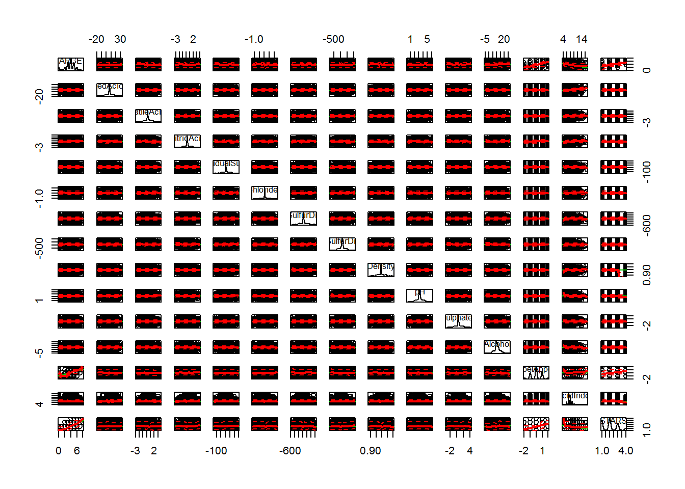

```{r warning=FALSE, echo=FALSE, message=FALSE}
DO_PERFORM_STEPS <- TRUE
DO_SCATTERPLOT = FALSE

library(stringr)
library(knitr)
library(sandwich)
library(MASS)
library(ROCR)
library(pROC)
library(ggplot2)
library(pscl)
library(boot)
library(gridExtra)
library(Amelia)
library(car)
library(plyr)
library(psych)
library(reshape2)

wine <- read.csv('wine-training-data.csv', stringsAsFactors = FALSE)

do_factors <- function(wine_instance){
  wine_instance <- within(wine_instance, {
      LabelAppeal <- factor(LabelAppeal)
      AcidIndex <- factor(AcidIndex)
      STARS <- factor(STARS)
  })
  return (wine_instance)
}
```

The purpose of this analysis is to develop models to predict the number of cases of wine samples a large wine manufacturer should offer to distributors to maximize wine sales.

Our data shows the chemical properties of commercially available wines as well as factors such as STARS ratings.

Our response variable is the number of sample cases purchased by distribution companies after sampling, a variable that has a direct correlation to overall wine sales. These cases are used to provide tasting samples to restaurants and wine stores around the United States.  The more sample cases purchased, the more likely is a wine to be sold at a high end restaurant. 

If the wine manufacturer can predict the number of cases, then that manufacturer will be able to adjust their wine offering to maximize sales.

Our training dataset includes information on `r nrow(wine)` wines. Each wine has `r ncol(wine)-2` potential predictor variables, and 1 response variable. The response variable is "TARGET", which is the number of cases purchased.

# 1) Data Exploration

A basic analysis of the numerical variables is below:

* Our histograms show normally distributed variables
* Our Box-Plots seem to have large amounts of instances outside of the 2nd and 3rd quartiles.  We will examine this further.

**WINE Data Histograms**  
```{r warning=FALSE, echo=FALSE, message=FALSE, eval=TRUE}
wine_no_indexes <- wine[,-c(1)]
d <- melt(wine_no_indexes[,sapply(wine_no_indexes, is.numeric)])

ggplot(d,aes(x = value)) + 
    facet_wrap(~variable,scales = "free") + 
    geom_histogram()
```

**WINE Data BoxPlots**  
```{r warning=FALSE, echo=FALSE, message=FALSE, eval=TRUE}
ggplot(d, aes(variable, value)) + 
  facet_wrap(~variable,scales = "free") + 
  geom_boxplot()
```

### Explore NA's:

The below table shows a summary of the NA values in the data.  Only STARS had an NA frequency higher than 10%, so this was a concern.  All NA values were thus replaced with samples from their respective collections, except for STARS, which required further analysis.

```{r warning=FALSE, echo=FALSE, message=FALSE}
not_na_count <- sapply(wine, function(y) sum(length(which(!is.na(y)))))
na_count <- sapply(wine, function(y) sum(length(which(is.na(y)))))
na_pct <- na_count / (na_count + not_na_count)

na_summary_df <- data.frame(not_na_count,na_count,na_pct)

missmap(wine, main = "Missing Values Before (Non-STARS) Replacement")

kable(na_summary_df)

# doing this because whole data set would be gone otherwise, show that in numbers!!!!!!!!!!!!!
wine$ResidualSugar[is.na(wine$ResidualSugar)] <- sample(wine$ResidualSugar[!is.na(wine$ResidualSugar)])
wine$Chlorides[is.na(wine$Chlorides)] <- sample(wine$Chlorides[!is.na(wine$Chlorides)])
wine$FreeSulfurDioxide[is.na(wine$FreeSulfurDioxide)] <- sample(wine$FreeSulfurDioxide[!is.na(wine$FreeSulfurDioxide)])
wine$TotalSulfurDioxide[is.na(wine$TotalSulfurDioxide)] <- sample(wine$TotalSulfurDioxide[!is.na(wine$TotalSulfurDioxide)])
wine$pH[is.na(wine$pH)] <- sample(wine$pH[!is.na(wine$pH)])
wine$Sulphates[is.na(wine$Sulphates)] <- sample(wine$Sulphates[!is.na(wine$Sulphates)])
wine$Alcohol[is.na(wine$Alcohol)] <- sample(wine$Alcohol[!is.na(wine$Alcohol)])

missmap(wine, main = "Missing Values After (Non-STARS) Replacement")

```

### Corrlation and Covariance:

There does not seem to be much correlation, much less any multi-collinearity issues:

```{r warning=FALSE, echo=FALSE, message=FALSE, eval=TRUE}
library(corrplot)
# remove index and stars (stars has nulls so shows up blank)
numeric_cols <- sapply(wine[,-c(1,16)], is.numeric)
M <- cor(wine[ , numeric_cols])
corrplot(M, method="circle")
```

***Summary of Wine Data Correlation:***

See the mean correlation for each column.  Each is near zero, showing us that the columns themselves are independent.

```{r warning=FALSE, echo=FALSE, message=FALSE, eval=TRUE}
summary(cor(wine[ , numeric_cols], use="complete.obs"))
```

***Scatterplot of Wine Data:***

This figure also serves to show the general horizontal (lack of) correlation between columns.

```{r warning=FALSE, echo=FALSE, message=FALSE, eval=TRUE}
if(DO_SCATTERPLOT){
  scatterplotMatrix(wine[,-c(1)])
}
```



***Summary of Wine Data Covariance:***

Most of the covariances are low, though a few stick out as possibly high.

```{r warning=FALSE, echo=FALSE, message=FALSE, eval=TRUE}
summary(cov(wine[ , numeric_cols], use="complete.obs"))
```

# 2) Data Preparation

### Looking for Patterns in the 'STARS' NA Values:

Next, due to such a high NA percent ***(`r format(100 * (sum(is.na(wine$STARS))/nrow(wine)), digits=2, nsmall=2)`%)***

Note that there are no ZEROS in the STARS field, 1 is the min:

```{r warning=FALSE, echo=FALSE, message=FALSE}
min(wine$STARS[!is.na(wine$STARS)])
```

Graphically, it seems that a blank stars field is analagous to a ZERO (see chart below).

```{r warning=FALSE, echo=FALSE, message=FALSE}
wine$STARS[is.na(wine$STARS)] <- 0

wine <- do_factors(wine)

m0 <- mean(wine$TARGET[wine$STARS == 0])
m1 <- mean(wine$TARGET[wine$STARS == 1])
m2 <- mean(wine$TARGET[wine$STARS == 2])
m3 <- mean(wine$TARGET[wine$STARS == 3])
m4 <- mean(wine$TARGET[wine$STARS == 4])

stars_summary_df <- data.frame(cbind(num_stars = c(0,1,2,3,4), mean_target = c(m0,m1,m2,m3,m4)))
stars_summary_df

ggplot(stars_summary_df, aes(num_stars, mean_target)) + geom_point(shape=1, size=5) + geom_smooth(method=lm,se=FALSE)
```

Though this calculation may be imperfect at the moment, we will show later that the calculation is to be discarded, and thus not worth figuring out a closer approximation for NA's replacement in the ***STARS*** field.

After the fill, we have what looks like a ***Zero-Inflated*** model on our hands.

```{r warning=FALSE, echo=FALSE, message=FALSE}
ggplot(wine, aes(TARGET, fill = STARS)) + geom_histogram(binwidth=1, bins = 8,  position="dodge")
```

# 3) Build Models

We will build 4 data sets from our training data:

* TRAINING set where NAs were replaced by ZEROs in the SCORE column.
* TRAINING set where NAs were ***NOT*** replaced by ZEROs in the SCORE column.
* TEST set where NAs were replaced by ZEROs in the SCORE column.
* TEST set where NAs were ***NOT*** replaced by ZEROs in the SCORE column.

Simple Step Selection will be used for attribute selection, and we will build 3 models for both sets, plus a "zerinfl" negative binomial, yielding a total of 7 models:

```{r warning=FALSE, echo=FALSE, message=FALSE}
wine.zeros <- wine
wine.nozeros <- wine[wine$STARS != 0,]

cutoff.zeros <- nrow(wine.zeros)*.75
wine.zeros.train <- wine.zeros[1:cutoff.zeros,]
wine.zeros.test <- wine.zeros[(cutoff.zeros+1):nrow(wine.zeros),]

cutoff.nozeros <- nrow(wine.nozeros)*.75
wine.nozeros.train <- wine.nozeros[1:cutoff.nozeros,]
wine.nozeros.test <- wine.nozeros[(cutoff.nozeros+1):nrow(wine.nozeros),]

wine.zeros <- do_factors(wine.zeros)
wine.nozeros <- do_factors(wine.nozeros)
wine.zeros.train <- do_factors(wine.zeros.train)
wine.zeros.test <- do_factors(wine.zeros.test)
wine.nozeros.train <- do_factors(wine.nozeros.train)
wine.nozeros.test <- do_factors(wine.nozeros.test)

```

* ***A Poisson GLM with SCORE: "Zeros-for-NAs"***
* ***A Poisson GLM with SCORE: "NAs Removed"***
* ***A Negative Binomial GLM with SCORE: "Zeros-for-NAs"***
* ***A Negative Binomial GLM with SCORE: "NAs Removed"***
* ***A Multiple Linear Regression Model with SCORE: "Zeros-for-NAs"***
* ***A Multiple Linear Regression Model with SCORE: "NAs Removed"***
* ***A Negative Binomial Model via "zeroinfl()": "Zeros-for-NAs"***

***Summaries for these Models are below:***

(To show our point regarding coefficients, we will show summaries for the 2 Negative Binomial Distributions.  Summaries of all 7 models, however, are located in the appendix).

```{r name="POISSON GLM ZEROS", message=FALSE, warning=FALSE, echo=FALSE, eval=TRUE}
fit.poisson.zeros <- step(glm(TARGET ~ . , family = poisson, data = wine.zeros.train), trace = FALSE)
#summary(fit.poisson.zeros)
```

```{r name="POISSON GLM ZEROS", message=FALSE, warning=FALSE, echo=FALSE, eval=TRUE}
fit.poisson.nozeros <- step(glm(TARGET ~ . , family = poisson, data = wine.nozeros.train), trace = FALSE)
#summary(fit.poisson.nozeros)
```

```{r name="NB GLM ZEROS", message=FALSE, warning=FALSE, echo=TRUE, eval=TRUE}
fit.nb.zeros <- step(glm.nb(TARGET ~ . , data = wine.zeros.train), trace = FALSE)
summary(fit.nb.zeros)
```

```{r name="NB GLM NO ZEROS", message=FALSE, warning=FALSE, echo=TRUE, eval=TRUE}
fit.nb.nozeros <- step(glm.nb(TARGET ~ . , data = wine.nozeros.train), trace = FALSE)
summary(fit.nb.nozeros)
```

```{r name="MLR GLM ZEROS", message=FALSE, warning=FALSE, echo=FALSE, eval=TRUE}
fit.mlr.zeros <- step(lm(TARGET ~ ., data = wine.zeros.train), trace = FALSE)
#summary(fit.mlr.zeros)
```

```{r name="MLR GLM NO ZEROS", message=FALSE, warning=FALSE, echo=FALSE, eval=TRUE}
fit.mlr.nozeros <- step(lm(TARGET ~ ., data = wine.nozeros.train), trace = FALSE)
#summary(fit.mlr.nozeros)
```

```{r name="MLR GLM NO ZEROS", message=FALSE, warning=FALSE, echo=FALSE, eval=TRUE}
fit.nb.zeroinfl <- zeroinfl(TARGET ~ VolatileAcidity + Chlorides + FreeSulfurDioxide + Density + Alcohol + LabelAppeal + AcidIndex + STARS | STARS, dist = "negbin", data = wine.zeros.train)
#summary(fit.nb.zeroinfl)
```

### Some Notes on the Models

* Though the 5th and 6th models are not GLMs, and thus should be used with normal distributions, we need to remember that the TARGET variable did have a normal distribution before the ZEROS replaced the NAs in the SCORE column.
* There seem to be MORE significant fields in the "with zeros" model than in the "no zeros" model. Will this mean higher accuracy?

### The Output of these 6 Models:

```{r name="CALC_SD_and_SE", message=FALSE, warning=FALSE, echo=FALSE}
calc_sd <- function(fit, data){
  prediction <- predict(fit, newdata=data, type='response')
  difference <- (prediction - mean(data$TARGET))
  difference_squared <- difference * difference
  return (mean(sqrt(difference_squared)))
}

calc_se <- function(fit, data){
  prediction <- predict(fit, newdata=data, type='response')
  difference <- (prediction - data$TARGET)
  difference_squared <- difference * difference
  return (mean(sqrt(difference_squared)))
}
```

```{r name="SD_SE_AIC_BIC", message=FALSE, warning=FALSE, echo=FALSE, eval=TRUE}
##################################################################
# SD Calcs:
##################################################################
sd.poisson.nozeros <- calc_sd(fit.poisson.nozeros, wine.nozeros.test)
sd.nb.nozeros <- calc_sd(fit.nb.nozeros, wine.nozeros.test)
sd.mlr.nozeros <- calc_sd(fit.mlr.nozeros, wine.nozeros.test)

sd.poisson.zeros <- calc_sd(fit.poisson.zeros, wine.zeros.test)
sd.nb.zeros <- calc_sd(fit.nb.zeros, wine.zeros.test)
sd.mlr.zeros <- calc_sd(fit.mlr.zeros, wine.zeros.test)

sd.nb.zeroinfl <- calc_sd(fit.nb.zeroinfl, wine.zeros.test)

SD <- format(c(sd.poisson.nozeros, sd.nb.nozeros, sd.mlr.nozeros, sd.poisson.zeros, sd.nb.zeros, sd.mlr.zeros, sd.nb.zeroinfl), digits=2, nsmall=2)

##################################################################
# SE Calcs:
##################################################################
se.poisson.nozeros <- calc_se(fit.poisson.nozeros, wine.nozeros.test)
se.nb.nozeros <- calc_se(fit.nb.nozeros, wine.nozeros.test)
se.mlr.nozeros <- calc_se(fit.mlr.nozeros, wine.nozeros.test)

se.poisson.zeros <- calc_se(fit.poisson.zeros, wine.zeros.test)
se.nb.zeros <- calc_se(fit.nb.zeros, wine.zeros.test)
se.mlr.zeros <- calc_se(fit.mlr.zeros, wine.zeros.test)

se.nb.zeroinfl <- calc_se(fit.nb.zeroinfl, wine.zeros.test)


SE <- format(c(se.poisson.nozeros, se.nb.nozeros, se.mlr.nozeros, se.poisson.zeros, se.nb.zeros, se.mlr.zeros, se.nb.zeroinfl), digits=2, nsmall=2)

##################################################################
# AIC Calcs:
##################################################################
AIC <- format(c(AIC(fit.poisson.nozeros), AIC(fit.nb.nozeros), AIC(fit.mlr.nozeros), AIC(fit.poisson.zeros), AIC(fit.nb.zeros), AIC(fit.mlr.zeros), AIC(fit.nb.zeroinfl)), digits=2, nsmall=2)

##################################################################
# BIC Calcs:
##################################################################
BIC <- format(c(BIC(fit.poisson.nozeros),BIC(fit.nb.nozeros),BIC(fit.mlr.nozeros),BIC(fit.poisson.zeros),BIC(fit.nb.zeros),BIC(fit.mlr.zeros),BIC(fit.nb.zeroinfl)), digits=2, nsmall=2)

##################################################################
# MDL Co-efficients:
##################################################################
all_fits <- c(fit.poisson.nozeros,fit.nb.nozeros,fit.mlr.nozeros,fit.poisson.zeros,fit.nb.zeros,fit.mlr.zeros,fit.nb.zeroinfl)

##################################################################
# LogLik Calcs:
##################################################################
LogLik <- format(c(logLik(fit.poisson.nozeros),logLik(fit.nb.nozeros),logLik(fit.mlr.nozeros),logLik(fit.poisson.zeros),logLik(fit.nb.zeros),logLik(fit.mlr.zeros),logLik(fit.nb.zeroinfl)), digits=2, nsmall=2)

```

```{r name="MLR GLM NO ZEROS", message=FALSE, warning=FALSE, echo=FALSE, eval=TRUE}
Model <- c("Poisson no 0s", "Poisson w/ 0s", "Negative Binomial no 0s", "Negative Binomial w/0s", "Multiple Linear Regression no 0s", "Multiple Linear Regression w/ 0s", "Zero-Infl Negative Binomial")
kable(cbind(Model, SE, SD, AIC, BIC, LogLik))
```

## Model Co-efficients

(Similar observations hold for the 4 models not shown also)

In the ***Negative Binomial Fit With Zeroes***, the following estimates are displayed for STARS*:

* STARS1 = 7.292e-01
* STARS2 = 1.058e+00
* STARS3 = 1.171e+00
* STARS4 = 1.301e+00

In the ***Negative Binomial Fit With NO Zeroes***, the following estimates are displayed for STARS*:

* STARS2 = 3.280e-01
* STARS3 = 4.389e-01
* STARS4 = 5.650e-01

Note that STARS1 has a huge increase in impact in the first fit, showing what an impact that NA to Zero translation had. (We'll see soon whether that impact was one of clarifying or confusing.)

# 4) Select Models

Before selecting a model, a quick explanation of why the "no ZEROs" models performed better:

One might think that either removing or keeping a value (such as the "Perfect-Graphical-Fit" Zeros-for-NAs) would possibly ***improve*** a model's accuracy, but at least ***maintain*** it. In this case, however, we saw a relatively large drop in performance of the models due to the inclusion of this attribute.  Why would this be?

One probable explanation is that true customers that actually ***BOUGHT*** the product took the time to fill their surveys out accurately.  Customers who didn't purchase the product (with less stake in the game and/or lack of knowledge of the product) simply did not contribute such useful data.  Due to this, the Zero-Inflated model is basically gone, and a linear model with a normal distribution again seems reasonable.

We know that Poisson Regression is actually a special case of Negative Binomial Regression (where the mean and the variance are equal), but in this case, the Poisson Regression did not yield more accurate results. We know that if there is overdispersion in the Poisson, then the estimates from the Poisson regression model are consistent but inefficient.  It seems from our Box Plots in Figure 1.2 that these overdispersions may have occurred.

Based on this and the above results table, it seems that the ***Negative Binomial no 0s*** is our winner.

"[When comparing models fitted by maximum likelihood to the same data, the smaller the AIC or BIC, the better the fit.](https://stat.ethz.ch/R-manual/R-devel/library/stats/html/AIC.html)""

```{r message=FALSE, warning=FALSE, echo=FALSE, eval=TRUE}
file_name <- "DATA621-HW-5-RESULTS.csv"
```

Our results have been written to ***`r file_name`***, and a sampling is shown below:


```{r message=FALSE, warning=FALSE, echo=FALSE, eval=TRUE}
##########3 *************************************
wine.final.test.data <- read.csv('wine-evaluation-data.csv', stringsAsFactors = FALSE)
colnames(wine.final.test.data) <- colnames(wine)
wine.final.test.data$STARS[is.na(wine.final.test.data$STARS)] <- 0
wine.final.test.data <- do_factors(wine.final.test.data)
```

```{r message=FALSE, warning=FALSE, echo=FALSE, eval=TRUE}
final_prediction <- predict(fit.nb.zeros, newdata=wine.final.test.data, type='response')

#final_prediction <- predict(fit.nb.nozeros, newdata=wine.final.test.data, type='response')
```

```{r message=FALSE, warning=FALSE, echo=FALSE, eval=TRUE}
# not offering half bottles:
final_prediction <- round(final_prediction, digits = 0)
# if NA, then no bottles of wine:
final_prediction[is.na(final_prediction)] <- 0

head(final_prediction, n=100)
write.csv(final_prediction, file = file_name, fileEncoding = "UTF-8", na = "NA")
```

# Appendix

## Summaries of all 7 Models:

```{r message=FALSE, warning=FALSE, echo=FALSE, eval=TRUE}
summary(fit.poisson.nozeros)
summary(fit.nb.nozeros)
summary(fit.mlr.nozeros)
summary(fit.poisson.zeros)
summary(fit.nb.zeros)
summary(fit.mlr.zeros)
summary(fit.nb.zeroinfl)
```

## All Code:

```{r code=readLines(knitr::purl('DATA621-HW-5.Rmd', documentation = 0)), eval = FALSE}

```